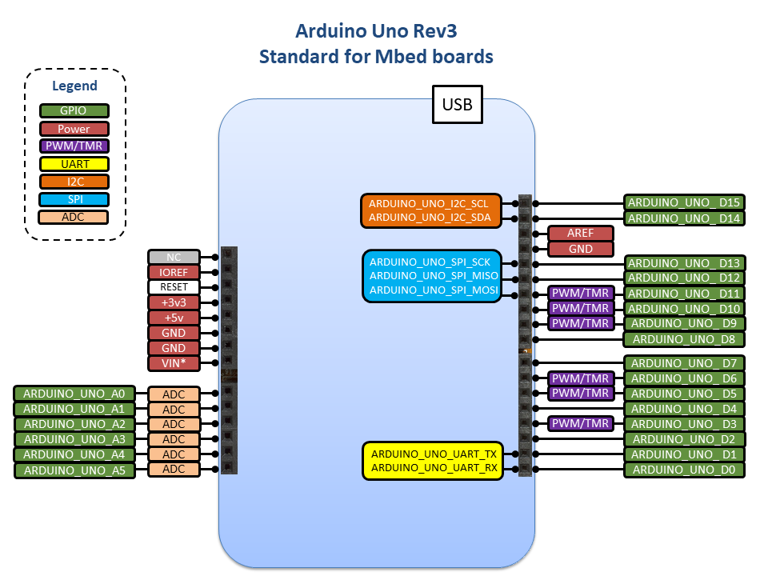

# Arduino Uno Pin Names design document

# Table of contents

1. [Table of contents](#table-of-contents).
    * [Revision history](#revision-history).
1. [Introduction](#introduction).
    1. [Overview and background](#overview-and-background).
    1. [Requirements and assumptions](#requirements-and-assumptions).
1. [Detailed design](#detailed-design).
    1. [Arduino Uno (Rev 3) connector Pins](#arduino-uno-rev-3-connector-pins).
        1. [I2C and SPI Definition for Arduino Uno (Rev3) Pins](#i2c-definition-for-arduino-uno-rev3-pins)
    1. [Board Components Pins](#board-components-pins).
        1. [LED Definition](#led-definition)
        1. [BUTTON Definition](#button-definition)
1. [Other information](#other-information).
    1. [Avoid Unnecessary Definitions](#avoid-unnecessary-definitions).

### Revision history

1.0 - Initial revision - Malavika Sajikumar, Marcelo Salazar - August 2020  
This document is written for Mbed OS 6.

# Introduction

### Overview and background

Mbed is designed so that application code written in the platform is portable across different Mbed supported boards with the same hardware capabilities or interfaces. However, the code, in most cases, is not truly portable due to the differences in pin name definitions for the same kind of interfaces across different boards. 

This design document provides rules and guidelines on how to define Arduino Uno connector pins in the board support package of development boards to achieve true code portability across various boards with Arduino Uno connectors.

### Requirements and assumptions

This document applies to the pin standards required for Arduino Uno connector which is used on multiple Mbed Enabled boards. The Arduino Uno connector has been stable since 2012 at its current revision, which is the Arduino Uno Rev3. All design choices in this document for the Arduino Uno connector are based on the Arduino Uno Rev3 connector implementation.

If the development board is defined as Arduino Uno compliant, the Arduino Uno connector standard has to be followed as described in this document and `ARDUINO_UNO` name should be defined as a supported form factor in targets.json file:

    "supported_form_factors": [
            "ARDUINO_UNO"
        ],

The Arduino Uno connector pins are defined in PinNames.h. The files resides in the following locations:

    targets/MCU_VENDOR/MCU_FAMILY/MCU_NAME/Board/PinNames.h

# Detailed design

To achieve meaningful portability of application code across various Mbed Enabled boards that are Arduino Uno compliant, the pin names used for the connector pins should be common across these boards. This document describes a set of rules on how and where to define these pins in the board support package.

### Arduino Uno (Rev3) connector Pins

The following diagrams shows the Arduino Uno Rev3 standard for Mbed boards:

**Digital and Analog pin definition**

The Arduino Uno (Rev3) form factor for Mbed boards must support and define both D0-D15 pins for digital GPIO and A0-A5 pins for analog inout as part of the default standard. These pins should be defined in PinNames.h file within a PinName enum. The prefix `ARDUINO_UNO_` distinguishes these pins from pins defined for other custom or common connectors that may have similar pin names. 

    // Arduino Uno (Rev3) connector pin connection naming  
    // Px_xx relates to the processor pin connected to the Arduino Uno (Rev3) connector pin

    ARDUINO_UNO_D0 = Px_xx,
    ARDUINO_UNO_D1 = Px_xx,
    ARDUINO_UNO_D2 = Px_xx,
    ARDUINO_UNO_D3 = Px_xx,
    ARDUINO_UNO_D4 = Px_xx,
    ARDUINO_UNO_D5 = Px_xx,
    ARDUINO_UNO_D6 = Px_xx,
    ARDUINO_UNO_D7 = Px_xx,
    ARDUINO_UNO_D8 = Px_xx,
    ARDUINO_UNO_D9 = Px_xx,
    ARDUINO_UNO_D10 = Px_xx,
    ARDUINO_UNO_D11 = Px_xx,
    ARDUINO_UNO_D12 = Px_xx,
    ARDUINO_UNO_D13 = Px_xx,
    ARDUINO_UNO_D14 = Px_xx,
    ARDUINO_UNO_D15 = Px_xx,

    ARDUINO_UNO_A0 = Px_xx,
    ARDUINO_UNO_A1 = Px_xx,
    ARDUINO_UNO_A2 = Px_xx,
    ARDUINO_UNO_A3 = Px_xx,
    ARDUINO_UNO_A4 = Px_xx,
    ARDUINO_UNO_A5 = Px_xx,

If the development board has the Arduino Uno connector in hardware, but does not comply with the Arduino Uno standard, whether it be with alternate functionality pins or no connected pins, the board should not be defined as Arduino Uno compliant and `ARDUINO_UNO` should not be added as a supported form factor in targets.json. Note this may result in a warning being generated at compile time to inform the user.

The pins with alternate functions have to be referenced using MCU pin names (Px_xx) or pin name aliases in application code. 

**I2C, SPI and UART definition**

All I2C, SPI and UART pin name alias definitions for the Arduino Uno (Rev3) connector pins should be defined in ArduinoUnoAliases.h in the Mbed OS HAL (common to all Arduino Uno compliant targets) as follows:

    #ifdef TARGET_FF_ARDUINO_UNO
    // Arduino Uno I2C signals aliases
    #define ARDUINO_UNO_I2C_SDA ARDUINO_UNO_D14
    #define ARDUINO_UNO_I2C_SCL ARDUINO_UNO_D15

    // Arduino Uno SPI signals aliases
    #define ARDUINO_UNO_SPI_CS   ARDUINO_UNO_D10
    #define ARDUINO_UNO_SPI_MOSI ARDUINO_UNO_D11
    #define ARDUINO_UNO_SPI_MISO ARDUINO_UNO_D12
    #define ARDUINO_UNO_SPI_SCK  ARDUINO_UNO_D13

    // Arduino Uno UART signals aliases
    #define ARDUINO_UNO_UART_TX  ARDUINO_UNO_D0
    #define ARDUINO_UNO_UART_RX  ARDUINO_UNO_D1

    #endif // TARGET_FF_ARDUINO_UNO

**Other pin functions**

Some Dx pinnames may support the usage of PWM or Timers functions. Although this is recomended, it's not a mandatory as requirement to be compliant with the Arduino Uno standard for Mbed boards.

Note this might be one of the main differencess accross Mbed boards and therefore the application should not assume the same behaviour for PWM and Timers for them.

The RESET signal should be defined in the Arduino Uno connector to let the user or an external component to put the MCU in reset state.

The VIN signal isn't strictly defined in the Arduino standard in some cases may work as a bi-directional power supply. Tipically it could accept between 5 to 12 volts, but it's not a requirement.

**Using Arduino Uno pins from an application**

> Pending to add details

### Non-valid definitions

The following is an example of definitions of pin names and comments on whether they are correctly defined or not.
   
    ARDUINO_UNO_D0 = PB_0,            // D0 signal is valid
    ARDUINO_UNO_D1 = PB_0,            // Not valid as it's duplicate  
    ARDUINO_UNO_D2 = ARDUINO_UNO_D0,  // Not valid as it's duplicate  
    ARDUINO_UNO_D3 = NA               // Not valid as doesn't exist

### Testing compliance

There should be both compile and run time checks to confirm whether a board has valid Arduino Uno pin names. The following checks should be implemented:

- ARDUINO_UNO_Dx/Ax pin definition and possible duplicates
- I2C compatibility on ARDUINO_UNO_D14/D15
- SPI compatibility on ARDUINO_UNO_D10/D11/D12/D13
- UART compatibility on ARDUINO_UNO_D0/D1
- PWM compatibility on ARDUINO_UNO_D3/D5/D6/D9/D10/D11
- Analog compatibility on ARDUINO_UNO_A0/A1/A2/A3/A4/A5

This can be achieved by using Greentea, for example:

    mbed test -t <toolchain> -m <target> -n *test_arduino_uno_pin_names* --compile
    mbed test -t <toolchain> -m <target> -n *test_arduino_uno_pin_names* --run

If the target claims to support the `ARDUINO_UNO` formfactor in targets.json but no valid Arduino Uno pinnames are detected, then an error should be generated.

